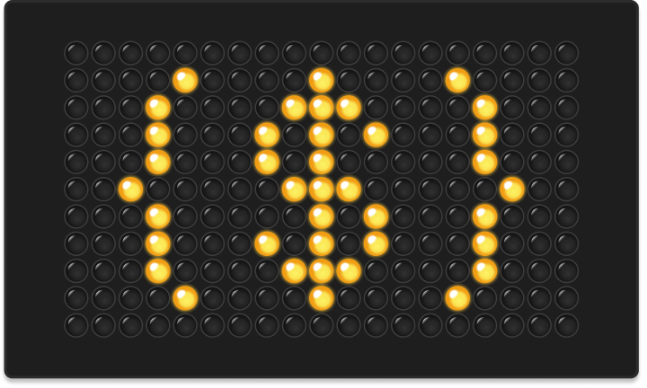

<div align="center">
	
<br>

</div>

# jsonpath-php

_An implementation of RFC 9535 [JSONPath](http://goessner.net/articles/JsonPath/)_

[](https://github.com/loilo/jsonpath-php/actions)
[](https://packagist.org/packages/loilo/jsonpath)


This is a PHP implementation of JSONPath, a query language for JSON. It aims for 100% compatibilty with the JSONPath syntax standardized in [RFC 9535](https://datatracker.ietf.org/doc/rfc9535/).

Currently, this library passes 99% of the work-in-progress [JSONPath Compliance Test Suite](https://github.com/jsonpath-standard/jsonpath-compliance-test-suite) (with the test suite version on [Jan 14, 2025](https://github.com/jsonpath-standard/jsonpath-compliance-test-suite/tree/9277705cda4489c3d0d984831e7656e48145399b)). All of the the missing 1% are UTF-16 related tests, which should not affect most day-to-day users (and which I'm not sure how to implement in PHP — any help is appreciated!)

## Installation

```sh
composer require loilo/jsonpath
```

Note that at least PHP 8.0 is needed to use jsonpath-php. For technical reasons, unit tests are only run against PHP 8.2+.

## Usage

```php
use Loilo\JSONPath\JsonPath;

$query = new JsonPath('$.users[*].name');

$result = $query->find([
	'users' => [
		[ 'name' => 'John Doe' ],
		[ 'name' => 'Jane Doe' ],
	],
]);

var_dump($result);

/*
Prints:

array(2) {
  [0]=>
  string(8) "John Doe"
  [1]=>
  string(8) "Jane Doe"
}
*/
```

## Development

### Project Scope

Please note that I'm striving for feature parity with the [jsonpath-js](https://github.com/ashphy/jsonpath-js) library and therefore will add neither features nor fixes to the search logic that are not reflected in jsonpath-js itself.

If you have any issues with the library that are _not_ obviously bugs in this PHP port, and you happen to know JavaScript, please check if your use case works correctly in the [online demo of jsonpath-js](https://jsonpath.com/) since that's the canonical implementation. If the issue appears there as well, please open an issue [in their repo](https://github.com/ashphy/jsonpath-js).

### Setup

To start development on jsonpath-php, you need git, PHP (≥ 8.2), Composer and npm.

Since code is formatted using [Prettier](https://prettier.io/), it's also recommended to use an [editor which supports Prettier](https://prettier.io/docs/en/editors.html) formatting.

Clone the repository and `cd` into it:

```sh
git clone https://github.com/loilo/jsonpath-php.git
cd jsonpath-php
```

Install Composer dependencies:

```sh
composer install
```

Install npm dependencies. They are needed for code formatting and for compiling the [Peggy](https://peggyjs.org/) grammar.

```
npm ci
```

### Formatting the Code

The code is formatted using [Prettier](https://prettier.io/). To format the code, run:

```sh
npm run format
```

### Compiling the Grammar

The JSONPath grammar is defined in `src/grammar/rfc9535-parser.pegjs`. To compile it to `src/PeggyParser.php`, run:

```sh
npm run generate-parser
```

### Quality Assurance

There are different kinds of code checks in place for this project. All of these are run when a pull request is submitted but can also be run locally:

<!-- prettier-ignore -->
Command | Purpose | Description
-|-|-
`vendor/bin/phpcs` | check code style | Run [PHP_CodeSniffer](https://github.com/squizlabs/PHP_CodeSniffer) to verify that the source code abides by the [PSR-12](https://www.php-fig.org/psr/psr-12/) coding style.
`vendor/bin/phpstan` | static analysis | Run [PHPStan](https://phpstan.org/) against the codebase to avoid type-related errors and unsafe coding patterns.
`vendor/bin/phpunit` | check program logic | Run all [PHPUnit](https://phpunit.de/) tests from the [`tests`](tests/) folder.

## Credit

All the credit goes to the creator of [jsonpath-js](https://github.com/ashphy/jsonpath-js). They did all the hard conceptual work, this PHP library is merely a port of their code.
